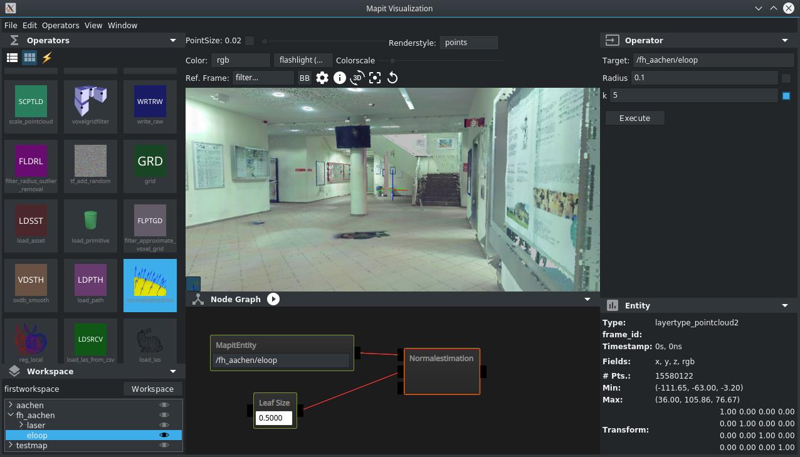

# mapit

* [Getting Started](https://maskor.github.io/mapit/)

## About

Mapit is a framework for storing and managing 3D (or robotic) data and keeping the history of its manipulation in a repository.
The data is stored in Entities and is structured in Layers.
It comes with a network interface and an QML based GUI which features a multiview approach.
With multiview multiple users can display the same data over network, also on a dedicated VR system. 

## Build

Mapit is used on Ubuntu 16.04, Arch Linux and Fedora 27.
The build description for Fedora is given here:

#### Dependencies

    dnf install boost-devel eigen3-devel cppzmq-devel OpenEXR-devel \
                protobuf protobuf-devel protobuf-lite-devel \
                cmake cmake-gui automake libtool gtest-devel gtest wget gcc-c++ \
                yaml-cpp-devel libuuid-devel \
                git
    dnf groupinstall "Development Tools" "Development Libraries"

#### self build PCL

Because we need the PCL without VTK and SSE we use a self build version

    dnf install flann flann-devel libpcap-devel
    mkdir ~/ws
    cd ~/ws/
    git clone https://github.com/PointCloudLibrary/pcl.git
    cd pcl/
    git checkout pcl-1.8.1

in case you also want the pcl_viewer, you have to compile the pcl twice like the following

    dnf install vtk-devel
    mkdir build_gui
    cd build_gui/
    cmake .. -DPCL_ENABLE_SSE=false
    make -j8
    make -j8 install

    dnf remove vtk-devel
    dnf install vtk-qt vtk-java vtk-qt-tcl vtk-tcl
    cd ..

end case

    mkdir build
    cd build/
    cmake .. -DWITH_VTK=false -DPCL_ENABLE_SSE=false
    make -j8
    make -j8 install

#### ROS

The detailed ROS installation is described here http://wiki.ros.org/Installation/Source.
We used "Desktop Install (recommended)", not full.
The tested installation of ROS is the following.

    dnf install python-empy ros-kinetic-rosconsole_bridge poco-devel tinyxml2-devel lz4-devel urdfdom-headers-devel qhull-devel libuuid-devel urdfdom-devel collada-dom-devel yaml-cpp-devel \
                python-rosdep python-rosinstall_generator python-wstool python-rosinstall @buildsys-build python2-netifaces
    mkdir -p /opt/ros/catkin_ws/
    chown -R tneumann:tneumann /opt/ros/
    cd /opt/ros/catkin_ws/
    rosdep init
    rosdep update
    rosinstall_generator desktop --rosdistro kinetic --deps --wet-only --tar > kinetic-desktop-wet.rosinstall
    wstool init -j8 src kinetic-desktop-wet.rosinstall
    rosinstall_generator pcl_conversions --rosdistro kinetic --deps --wet-only --tar > kinetic-pcl_conversions-wet.rosinstall
    wstool merge -t src kinetic-pcl_conversions-wet.rosinstall
    wstool update -t src
    rosdep install --from-paths src --ignore-src --rosdistro kinetic -y

now there are some packages to be fixed:

in src/geometric_shapes/CMakeLists.txt remove "EIGEN3" in context of "catkin_package" and add below
find_package(Eigen3 REQUIRED)

in src/collada_urdf/collada_parser/CMakeLists.txt change 2.3 to 2.4

    ./src/catkin/bin/catkin_make_isolated --install -DCMAKE_BUILD_TYPE=Release

add the following to your ~.bashrc
    source /opt/ros/catkin_ws/install_isolated/setup.bash

#### openVDB

    dnf install blosc-devel blosc cppunit-devel cppunit-devel glfw-devel ilmbase-devel OpenEXR-devel tbb-devel python-devel libXi-devel
    cd ws/
    git clone https://github.com/dreamworksanimation/openvdb.git
    cd openvdb/
    git checkout v4.0.2
    mkdir build
    cd build
    cmake .. -DGLFW_LIBRARY_PATH=/usr/lib64/ \
             -DIlmbase_IEX_LIBRARY=/usr/lib64/libIex.so \
             -DIlmbase_ILMTHREAD_LIBRARY=/usr/lib64/libIlmThread.so \
             -DOpenexr_ILMIMF_LIBRARY=/usr/lib64/libIlmImf.so \
             -DBLOSC_LOCATION=/usr/ \
             -DTBB_LOCATION=/usr/ \
             -DCPPUNIT_LOCATION=/usr/ \
             -DOPENEXR_LOCATION=/usr/ \
             -DILMBASE_LOCATION=/usr/ \
             -DUSE_GLFW3=true \
             -DGLFW3_LOCATION=/usr/ \
             -DOPENVDB_DISABLE_BOOST_IMPLICIT_LINKING=false \
             -DOPENVDB_ENABLE_3_ABI_COMPATIBLE=false
    
    make -j8
    make install

#### Qt

In Fedora 27 it seem to be possible to directly use the system packages, this however is not widly tested

    dnf install qt5 qt5-devel

Alternatively the newest version can be installed with the official script

    cd ~/tmp
    wget http://download.qt.io/official_releases/online_installers/qt-unified-linux-x64-online.run
    chmod +x qt-unified-linux-x64-online.run
    ./qt-unified-linux-x64-online.run

#### json11

    cd ~/ws
    git clone https://github.com/dropbox/json11.git
    cd json11/
    mkdir build
    cd build
    cmake .. -DCMAKE_CXX_FLAGS="-std=c++11" -DCMAKE_CXX_FLAGS_DEBUG="-g -std=c++11" 
    make -j8
    make -j8 install

#### mapit

    cd ~/ws
    git clone --recursive git@github.com:MASKOR/mapit.git
    
    ldconfig
    updatedb
    cd ~/ws/mapit/
    mkdir build
    cd build
    export MAPIT_CMAKE_QT_PATH=<path-to-your-qt-installation>/Qt/5.9.2/gcc_64/
    export MAPIT_CMAKE_SOFTWARE_PATH=<path-to-your-ws-directory>/ws
    cmake .. -DCMAKE_PREFIX_PATH=$MAPIT_CMAKE_QT_PATH \
             -DQt5Core_DIR=$MAPIT_CMAKE_QT_PATH/lib/cmake/Qt5Core \
             -DQt5Gui_DIR=$MAPIT_CMAKE_QT_PATH/lib/cmake/Qt5Gui \
             -DQt5Network_DIR=$MAPIT_CMAKE_QT_PATH/lib/cmake/Qt5Network \
             -DQt5Qml_DIR=$MAPIT_CMAKE_QT_PATH/lib/cmake/Qt5Qml \
             -DQt5Quick_DIR=$MAPIT_CMAKE_QT_PATH/lib/cmake/Qt5Quick \
             -DQt5Test_DIR=$MAPIT_CMAKE_QT_PATH/lib/cmake/Qt5Test \
             -DQt5Widgets_DIR=$MAPIT_CMAKE_QT_PATH/lib/cmake/Qt5Widgets \
             -DQt53DCore_DIR=$MAPIT_CMAKE_QT_PATH/lib/cmake/Qt53DCore \
             -DCMAKE_CXX_FLAGS="-std=c++11" -DCMAKE_CXX_FLAGS_DEBUG="-g -std=c++11" \
             -DCMAKE_BUILD_TYPE=Debug \
             -DMAPIT_ENABLE_VISUALIZATION=true \
             -DWITH_LAS=false \
             -DHAVE_LASZIP=false \
             -DMAPIT_ENABLE_OPENVDB=true
    
    make -j8

Acknowledgements
================

This work was funded in part by the German Federal Ministry of Education and
Research in the programme under grant 033R126C.
